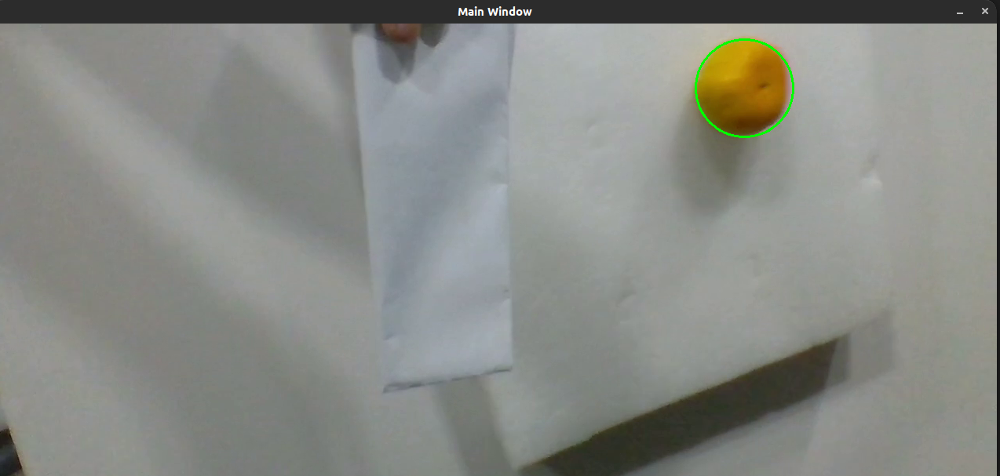
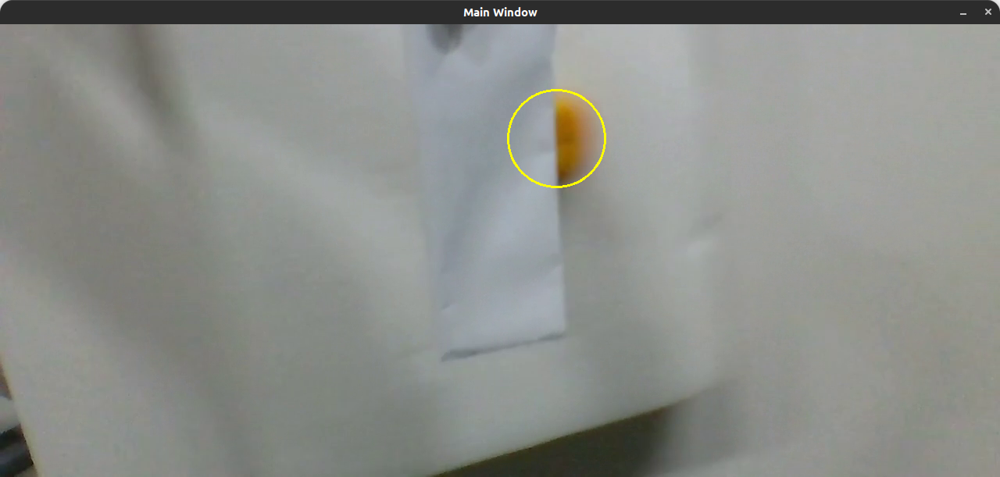

# Object-Track

一个实现对物体进行跟踪，并对物体一段时间后位置进行预测的程序

## 示例





## 安装说明

### 依赖项
apturl==0.5.2
bcrypt==3.2.0
blinker==1.4
Brlapi==0.8.3
certifi==2020.6.20
chardet==4.0.0
chrome-gnome-shell==0.0.0
click==8.0.3
- Opencv (版本 >= 4.8)
- OpenMP

### 安装

1. 通过以下官方教程安装OpenCV [OpenCV 官方教程](https://docs.opencv.org/4.x/d9/df8/tutorial_root.html)。 

2. OpenMP：

   安装OpenMP需要先确保系统的编译器支持OpenMP进行编译常见的支持OpenMP的编译器有GCC（GNU Compiler Collection）和Clang（基于LLVM的编译器）。

   1. 在Ubuntu上：
   
      - 安装GCC
   
      ```shell
      sudo apt-get update
      sudo apt-get install gcc
      
      gcc --version
      ```
   
   2. 在Windows下
   
      1. 安装MinGW：MinGW是一个用于Windows的GNU工具集，其中包含了GCC编译器。你可以从MinGW的官网（https://osdn.net/projects/mingw/）下载安装程序，并按照提示安装。
   
      2. 确认GCC版本：确认安装的GCC版本是否支持OpenMP，可以运行以下命令：
   
         ```bash
         gcc --version
         ```